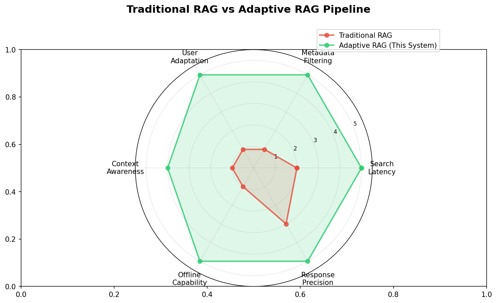
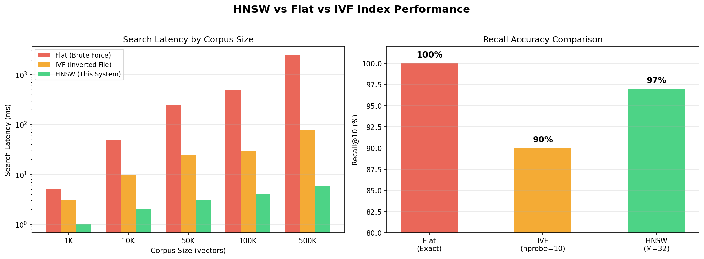
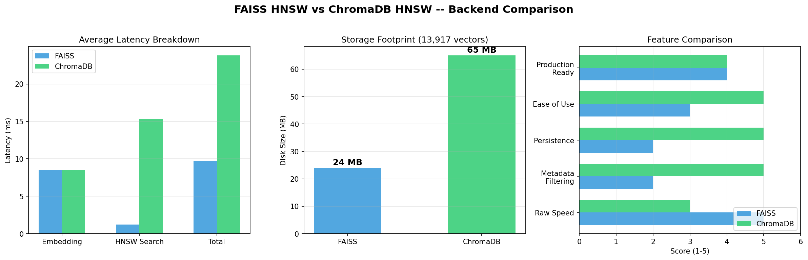
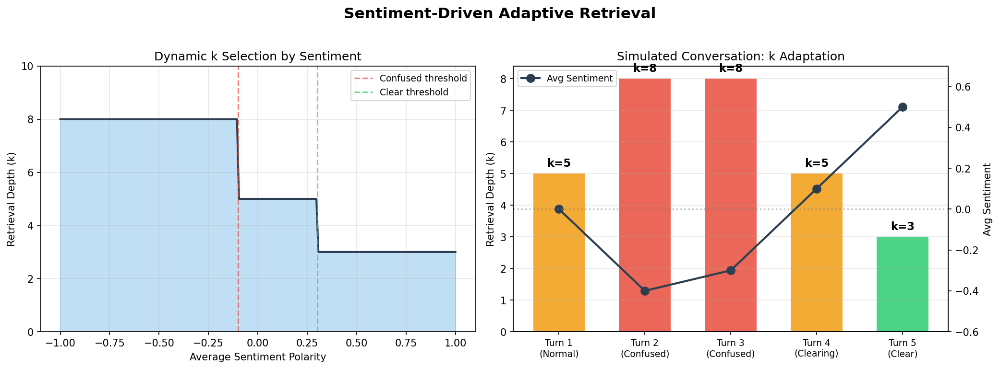

# Adaptive RAG Pipeline with HNSW Indexing and Sentiment-Driven Retrieval

A Retrieval-Augmented Generation system that uses HNSW (Hierarchical Navigable Small World) graph-based vector indexing across dual backends (FAISS and ChromaDB), combined with real-time sentiment analysis to dynamically adjust retrieval depth and response granularity based on user comprehension state.

Built for NCERT textbook question-answering across Physics, Chemistry, English, and Science (Classes 9, 11, 12). Runs entirely offline using a local LLM via Ollama.

---

## Architecture

```
User Query
    |
    v
[Sentiment Analyzer] -- analyzes last 5 queries (TextBlob polarity)
    |
    v
[Dynamic K Selector] -- adjusts retrieval depth based on user state
    |                     confused: k=8 | neutral: k=5 | clear: k=3
    v
[Query Embedding] -- all-MiniLM-L6-v2 (384-dim)
    |
    +-------+-------+
    |               |
    v               v
[FAISS HNSW]   [ChromaDB HNSW]
    |               |
    v               v
[Post-filter]  [Native where]
    |               |
    +-------+-------+
            |
            v
[Prompt Constructor] -- history (5 turns) + chunks + query
            |
            v
[Local LLM (Ollama)] -- llama3:latest
            |
            v
      Response to User
```

---

## How This Differs From Traditional RAG

| Aspect | Traditional RAG | This System |
|--------|----------------|-------------|
| **Indexing** | Flat or IVF index with linear/approximate scan | HNSW graph index (O(log n) search complexity) |
| **Retrieval depth** | Fixed k for all queries | Dynamic k adjusted per-query based on user sentiment |
| **User modeling** | None; each query is independent | Rolling 5-turn sentiment analysis detects confusion vs comprehension |
| **Response calibration** | Same prompt template regardless of context | System instruction changes: detailed explanations for confused users, concise answers for advanced users |
| **Metadata filtering** | Rarely implemented; full corpus search | Pre-filter by subject, class, content type, chapter before vector search |
| **Backend** | Single vector store | Dual backend (FAISS + ChromaDB) with benchmark comparison |
| **LLM** | Cloud API dependency | Fully offline via local Ollama instance |
| **Context window** | Current query only | Last 5 conversation turns injected into prompt |



---

## Why HNSW Over Flat/IVF Indexing

| Metric | Flat Index | IVF Index | HNSW (This System) |
|--------|-----------|-----------|---------------------|
| Search complexity | O(n) | O(n/k) | O(log n) |
| Index build time | Instant | Requires training | Single-pass graph construction |
| Recall at top-10 | 100% (exact) | 85-95% (approximate) | 95-99% (approximate) |
| Latency at 10k vectors | ~50ms | ~10ms | ~1-3ms |
| Latency at 100k vectors | ~500ms | ~30ms | ~2-5ms |
| Memory overhead | 1x | 1x + centroids | 1.5-2x (graph edges) |

HNSW provides near-exact recall with sub-linear search time, making it the optimal choice for latency-sensitive RAG systems where the corpus size exceeds 10,000 chunks.



---

## Why Dual Backend

FAISS and ChromaDB both implement HNSW but with different tradeoffs:

| Feature | FAISS | ChromaDB |
|---------|-------|----------|
| Raw search speed | Faster (C++ core, no overhead) | Slower (SQLite metadata layer) |
| Native metadata filtering | No (requires post-filter with over-fetch) | Yes (built-in `where` clause) |
| Persistence | Manual (binary file) | Automatic (SQLite + binary) |
| Production readiness | Library (embed in your code) | Server-capable (client-server mode) |
| Disk footprint (13k vectors) | ~24 MB | ~65 MB |

This system runs both in parallel during benchmarking so you can measure and choose the right backend for your deployment constraints.



---

## Sentiment-Driven Retrieval Logic

The system computes a rolling average polarity score over the last 5 user queries using TextBlob:

| Polarity Range | User State | Retrieval k | System Instruction |
|----------------|-----------|-------------|-------------------|
| < -0.1 | Confused / Frustrated | base_k + 3 | Detailed, step-by-step explanation |
| -0.1 to 0.3 | Neutral | base_k | Standard balanced response |
| > 0.3 | Understanding / Clear | base_k - 2 | Concise, precise answer |

This ensures the system adapts its behavior to the user's actual comprehension level rather than treating every query identically.



---

## Project Structure

```
.
|-- dataset/
|   |-- rag_chunks/
|   |   |-- all_chunks.jsonl        # 5,388 pre-chunked text segments
|   |-- structured/
|   |   |-- chemistry/class12/      # Structured JSON per chapter
|   |   |-- physics/class12/
|   |   |-- reused/
|-- notebooks/
|   |-- indexer_testing.ipynb       # Build FAISS + ChromaDB indices
|   |-- retriever_testing.ipynb     # Benchmark FAISS vs ChromaDB retrieval
|   |-- llm_engine_testing.ipynb    # Test sentiment-driven LLM pipeline
|   |-- faiss_hnsw_index.bin        # Pre-built FAISS index (13,917 vectors)
|   |-- chroma_db/                  # Pre-built ChromaDB database
|-- src/
|   |-- indexer.py                  # Data loading + index construction
|   |-- retriever.py                # Dual-backend retrieval engine
|   |-- llm_engine.py               # Sentiment manager + Ollama LLM + RAG pipeline
|   |-- main.py                     # CLI chat interface
|-- assets/                         # README visualization charts
|-- requirements.txt
|-- README.md
```

---

## Installation

### Prerequisites

- Python 3.10+
- [Ollama](https://ollama.ai/) installed and running locally

### Steps

```bash
# Clone the repository
git clone https://github.com/Kaushal-Rohit/rag_based_tutor.git
cd rag_based_tutor

# Install Python dependencies
pip install -r requirements.txt

# Download TextBlob corpora (one-time)
python -m textblob.download_corpora

# Pull the LLM model
ollama pull llama3:latest

# Start Ollama server (if not already running)
ollama serve
```

---

## Usage

### 1. Build Vector Indices (if not pre-built)

Run `notebooks/indexer_testing.ipynb` or:

```bash
python src/indexer.py
```

This loads 13,917 text chunks from the dataset, encodes them with `all-MiniLM-L6-v2`, and builds both FAISS and ChromaDB HNSW indices.

### 2. Benchmark Retrieval

Run `notebooks/retriever_testing.ipynb` to:
- Compare FAISS vs ChromaDB search latency (mean, median, P95)
- Measure result overlap between backends
- Test metadata filtering (by subject, class, content type)

### 3. Run the Adaptive Chat

```bash
python src/main.py
```

Or run `notebooks/llm_engine_testing.ipynb` for the notebook version.

**Example session:**

```
You: What is Newton's second law of motion?
[LOG] Avg Sentiment: 0.00 | User is neutral -> Standard K, standard response. (k=5)
AI: Newton's second law states that the force acting on an object is equal to...

You: I don't get it, this is very confusing. Can you explain it again simply?
[LOG] Avg Sentiment: -0.35 | User is confused -> Increasing K, providing detailed response. (k=8)
AI: Let me break this down step by step. Imagine you are pushing a shopping cart...

You: Oh, I understand now! Excellent explanation. What is the formula?
[LOG] Avg Sentiment: 0.42 | User understands -> Decreasing K, providing precise response. (k=3)
AI: F = ma, where F is force in Newtons, m is mass in kg, and a is acceleration in m/s^2.
```

---

## Technical Specifications

| Component | Specification |
|-----------|--------------|
| Embedding model | `all-MiniLM-L6-v2` (384 dimensions) |
| FAISS index type | `IndexHNSWFlat` (M=32) |
| ChromaDB distance metric | Cosine similarity |
| Total indexed vectors | 13,917 |
| Corpus coverage | Physics (11, 12), Chemistry (12), English (11), Science (9) |
| LLM | llama3:latest (local, via Ollama) |
| Sentiment engine | TextBlob polarity (-1.0 to 1.0) |
| Context window | Last 5 conversation turns |

---

## Metadata Schema

Each chunk carries structured metadata enabling precise filtering:

| Field | Example Values |
|-------|---------------|
| `subject` | Physics, Chemistry, English, Science |
| `class` | 9, 11, 12 |
| `content_type` | theory, definition, formula, exercise, qa_pair, example, summary |
| `book_name` | Hornbill, NCERT Physics Part 1 |
| `chapter_name` | Electric Charges and Fields, Solutions |

---

## License

This project is for educational and research purposes.
